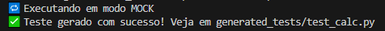
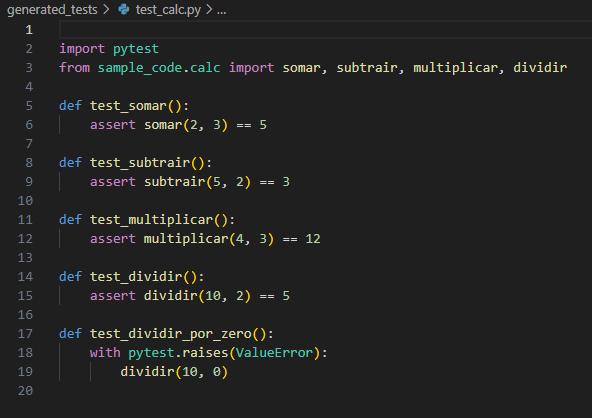
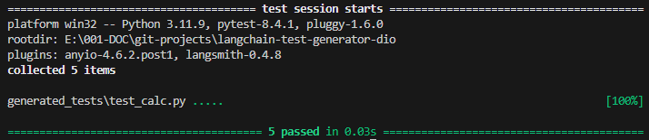

# LangChain Unit Test Generator 🚀

Projeto final do bootcamp DIO: **Gerando Testes Unitários com LangChain e Azure ChatGPT**.

## 📌 Descrição

Automatização da criação de testes unitários utilizando LLMs. Este projeto gera testes com **pytest** a partir de códigos Python, usando dois modos:

- `prod`: Gera os testes via **Azure OpenAI + LangChain**
- `mock`: Simula uma resposta da API (sem custos)

## 🧪 Exemplo de código (`sample_code/calc.py`)

```python
def somar(a, b):
    return a + b
# ...
```

## 🔁 Modos de Execução

Controle pelo `.env`:
```env
MODE=prod     # Para rodar com Azure ChatGPT
MODE=mock     # Para simular resultado (sem consumir API)
```

## 📂 Estrutura

```
langchain-unit-test-generator/
├── main.py
├── mock_response.py
├── sample_code/
│   └── calc.py
├── generated_tests/
│   └── test_calc.py
├── .env.example
└── README.md
```

## ▶️ Como Rodar

1. Clone o projeto
2. Crie um `.env` com base no `.env.example`
3. Instale as dependências:

```bash
pip install -r requirements.txt
```

4. Execute:

```bash
python main.py
```

5. Teste o arquivo gerado:

```bash
pytest generated_tests/
```

> ⚠️ Observação: caso tenha problemas com os comandos tente executar com **python3** ou **python3 -m**.

## 📚 Tecnologias

- Python
- LangChain
- Azure OpenAI / ChatGPT
- Pytest

## 📸 Imagens (opcional)

- Execução:



- Código test_ gerado:



- Execução do test:




---

🎯 Projeto desenvolvido como parte do desafio do Bootcamp DIO — Gerando Testes Unitários com LangChain e Azure ChatGPT
